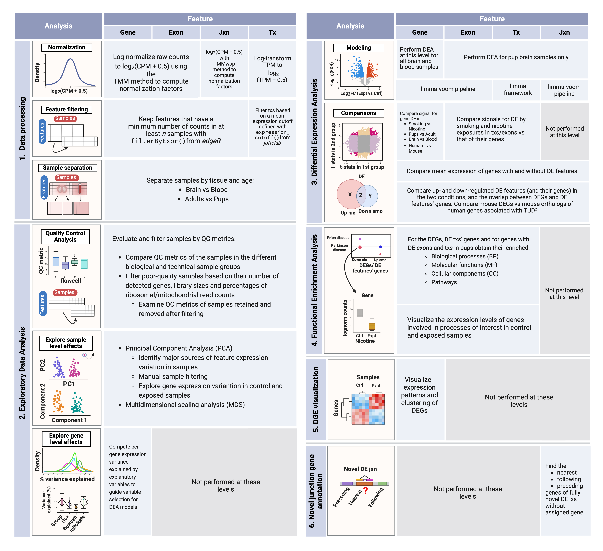

<!-- README.md is generated from README.Rmd. Please edit that file -->

# smokingMouse

<!-- badges: start -->

[](https://github.com/LieberInstitute/smokingMouse/issues)
[](https://github.com/LieberInstitute/smokingMouse/pulls)
[](https://lifecycle.r-lib.org/articles/stages.html#experimental)
[](https://bioconductor.org/checkResults/release/data-experiment-LATEST/smokingMouse)
[](https://bioconductor.org/checkResults/devel/data-experiment-LATEST/smokingMouse)
[](http://bioconductor.org/packages/stats/bioc/smokingMouse/)
[](https://support.bioconductor.org/tag/smokingMouse)
[](http://bioconductor.org/checkResults/devel/data-experiment-LATEST/smokingMouse/)
[](https://bioconductor.org/packages/release/bioc/html/smokingMouse.html#since)
[](https://github.com/LieberInstitute/smokingMouse/actions/workflows/R-CMD-check-bioc.yaml)

<!-- badges: end -->

Welcome to the `smokingMouse` project! Here you’ll be able to access the
mouse expression data used for the analysis of the
smoking-nicotine-mouse LIBD project.

## Overview

This bulk RNA-sequencing project consisted of a differential expression
analysis (DEA) involving 4 data types: genes, transcripts, exons, and
exon-exon junctions. The main goal of this study was to explore the
effects of prenatal exposure to smoking and nicotine on the developing
mouse brain. As secondary objectives, this work evaluated: 1) the
affected genes by each exposure in the adult female brain in order to
compare offspring and adult results, and 2) the effects of smoking on
adult blood and brain to search for overlapping biomarkers in both
tissues. Finally, DEGs identified in mouse were compared against
previously published results in human (Semick et al., 2020 and Toikumo
et al., 2023).

## Study design

<figure>

<figcaption style="color: gray; line-height: 0.88; text-align: justify">

<font size="-1.5"><b>Experimental design of the study</b>. <b>A)</b> 21
pregnant mice were split into two experiments: in the first one prenatal
nicotine exposure (PNE) was modeled administering nicotine (n=3) or
vehicle (n=3) to the dams during gestation, and in the second maternal
smoking during pregnancy (MSDP) was modeled exposing dams to cigarette
smoke during gestation (n=8) or using them as controls (n=7). A total of
137 pups were born: 19 were born to nicotine-administered mice, 23 to
vehicle-administered mice, 46 to smoking-exposed mice, and 49 to smoking
control mice. 17 nonpregnant adult females were also
nicotine-administered (n=9) or vehicle-administered (n=8) to model adult
nicotine exposure, and 9 additional nonpregnant dams were
smoking-exposed (n=4) or controls (n=5) to model adult smoking. Frontal
cortex samples of all P0 pups (n=137: 42 for PNE and 95 for MSDP) and
adults (n=47: 23 for the nicotine experiment and 24 for the smoking
experiment) were obtained, as well as blood samples from the
smoking-exposed and smoking control adults (n=24), totaling 208 samples.
Number of donors and samples are indicated in the figure. <b>B)</b> RNA
was extracted from such samples and bulk RNA-seq experiments were
performed, obtaining expression counts for genes, transcripts, exons,
and exon-exon junctions.

</font>

</figcaption>
</figure>

## Workflow

The next table summarizes the analyses done at each level.

<figure>

<figcaption style="color: gray; line-height: 0.94; text-align: justify">

<font size="-1.5"><b> Summary of analysis steps across gene expression
feature levels</b>:

<b>1. Data processing</b>: counts of genes, exons, and exon-exon
junctions were normalized to CPM and log2-transformed; transcript
expression values were only log2-transformed since they were already in
TPM. Lowly-expressed features were removed using the indicated functions
and samples were separated by tissue and age in order to create subsets
of the data for downstream analyses.

<b>2. Exploratory Data Analysis (EDA)</b>: QC metrics of the samples
were examined and used to filter the poor quality ones. Sample level
effects were explored through dimensionality reduction methods and
segregated samples in PCA plots were removed from the datasets. Gene
level effects were evaluated with analyses of variance partition.

<b>3. Differential Expression Analysis (DEA)</b>: with the relevant
variables identified in the previous steps, the DEA was performed at the
gene level for nicotine and smoking exposure in adult and pup brain
samples, and for smoking exposure in adult blood samples; DEA at the
rest of the levels was performed for both exposures in pup brain only.
DE signals of the genes in the different conditions, ages, tissues, and
species (using human results from $^1$[Semick et al.,
2020](https://www.nature.com/articles/s41380-018-0223-1)) were
contrasted, as well as the DE signals of exons and transcripts vs those
of their genes. Mean expression of DEGs and non-DEGs genes with and
without DE features was also analyzed. Then, all resultant DEGs and DE
features (and their genes) were compared by direction of regulation (up
or down) between and within exposures (nicotine/smoking); mouse DEGs
were also compared against human genes associated with TUD from
$^2$[Toikumo et al.,
2023](https://www.medrxiv.org/content/10.1101/2023.03.27.23287713v2).

<b>4. Functional Enrichment Analysis</b>: GO & KEGG terms significantly
enriched in the clusters of DEGs and genes of DE transcripts and exons
were obtained.

<b>5. DGE visualization</b>: the log2-normalized expression of DEGs was
represented in heat maps in order to distinguish the groups of up- and
down-regulated genes.

<b>6. Novel junction gene annotation</b>: for uncharacterized DE
junctions with no annotated gene, their nearest, preceding, and
following genes were determined. </font>

<font size="0.8">Abbreviations: Jxn: junction; Tx(s): transcript(s);
CPM: counts per million; TPM: transcripts per million; TMM: Trimmed Mean
of M-Values; TMMwsp: TMM with singleton pairing; QC: quality control;
PC: principal component; DEA: differential expression analysis; DE:
differential expression/differentially expressed; FC: fold-change; FDR:
false discovery rate; DEGs: differentially expressed genes; TUD: tobacco
use disorder; DGE: differential gene expression. </font>

</figcaption>
</figure>

All `R` scripts created to perform such analyses can be found in [code
on GitHub](https://github.com/LieberInstitute/smoking-nicotine-mouse/).

## smoking Mouse datasets

The mouse datasets contain the following data in a single `R`
`RangedSummarizedExperiment`\* object for each feature (genes,
transcripts, exons, and exon-exon junctions):

- **Raw data**: raw read counts (for genes, exons, and junctions) or TPM
  (for transcripts), also including the original metadata of the
  expression features and samples.
- **Processed data**: normalized and log-scaled counts of the same
  features (log(CPM+0.5) for genes, exons, and junctions, or
  log(TPM+0.5) for transcripts). In addition to the feature and sample
  information, the datasets contain information of which ones were used
  in downstream analyses (the ones that passed filtering steps), and
  which features were differentially expressed in the different
  experiments.

Moreover, you can find human data generated in Semick et al., (2018) in
Mol Psychiatry (DOI: <https://doi.org/10.1038/s41380-018-0223-1>) that
contain the results of a DEA for cigarette smoke exposure in adult and
prenatal human brain.

\*For more details, check the documentation for
[`RangedSummarizedExperiment`](https://www.bioconductor.org/packages/devel/bioc/vignettes/SummarizedExperiment/inst/doc/SummarizedExperiment.html)
objects.

## Data specifics

- *‘rse_gene_mouse_RNAseq_nic-smo.Rdata’*: (`rse_gene` object) the gene
  RSE object contains the raw and log-normalized expression data of
  55,401 mouse genes across the 208 samples from brain and blood of
  control and nicotine/smoking-exposed pup and adult mice.
- *‘rse_tx_mouse_RNAseq_nic-smo.Rdata’*: (`rse_tx` object) the tx RSE
  object contains the raw and log-scaled expression data of 142,604
  mouse transcripts across the 208 samples from brain and blood of
  control and nicotine/smoking-exposed pup and adult mice.
- *‘rse_exon_mouse_RNAseq_nic-smo.Rdata’*: (`rse_exon` object) the exon
  RSE object contains the raw and log-normalized expression data of
  447,670 mouse exons across the 208 samples from brain and blood of
  control and nicotine/smoking-exposed pup and adult mice.
- *‘rse_jx_mouse_RNAseq_nic-smo.Rdata’*: (`rse_jx` object) the jx RSE
  object contains the raw and log-normalized expression data of
  1,436,068 mouse exon-exon junctions across the 208 samples from brain
  and blood of control and nicotine/smoking-exposed pup and adult mice.

All the above datasets contain the sample and feature metadata and
additional data of the results obtained in the filtering steps and the
DEA.

- *‘de_genes_prenatal_human_brain_smoking.Rdata’*:
  (`de_genes_prenatal_human_brain_smoking` object) data frame with DE
  statistics of 18,067 human genes for cigarette smoke exposure in
  prenatal human cortical tissue.
- *‘de_genes_adult_human_brain_smoking.Rdata’*:
  (`de_genes_adult_human_brain_smoking` object) data frame with DE
  statistics of 18,067 human genes for cigarette smoke exposure in adult
  human cortical tissue.

## Installation instructions

Get the latest stable `R` release from
[CRAN](http://cran.r-project.org/). Then install `smokingMouse` from
[Bioconductor](http://bioconductor.org/) using the following code:

``` r
if (!requireNamespace("BiocManager", quietly = TRUE)) {
    install.packages("BiocManager")
}

BiocManager::install("smokingMouse")
```

And the development version from
[GitHub](https://github.com/LieberInstitute/smokingMouse) with:

``` r
BiocManager::install("LieberInstitute/smokingMouse")
```

## Example of how to access the data

Below there’s example code on how to access the mouse and human gene
data but can do the same for any of the datasets previously described.
The datasets are retrieved from [Bioconductor](http://bioconductor.org/)
`ExperimentHub`.

``` r
## Connect to ExperimentHub
library(ExperimentHub)
#> Loading required package: BiocGenerics
#> Loading required package: generics
#> 
#> Attaching package: 'generics'
#> The following objects are masked from 'package:base':
#> 
#>     as.difftime, as.factor, as.ordered, intersect, is.element, setdiff,
#>     setequal, union
#> 
#> Attaching package: 'BiocGenerics'
#> The following objects are masked from 'package:stats':
#> 
#>     IQR, mad, sd, var, xtabs
#> The following objects are masked from 'package:base':
#> 
#>     anyDuplicated, aperm, append, as.data.frame, basename, cbind,
#>     colnames, dirname, do.call, duplicated, eval, evalq, Filter, Find,
#>     get, grep, grepl, is.unsorted, lapply, Map, mapply, match, mget,
#>     order, paste, pmax, pmax.int, pmin, pmin.int, Position, rank,
#>     rbind, Reduce, rownames, sapply, saveRDS, table, tapply, unique,
#>     unsplit, which.max, which.min
#> Loading required package: AnnotationHub
#> Loading required package: BiocFileCache
#> Loading required package: dbplyr
eh <- ExperimentHub::ExperimentHub()
#> snapshotDate(): 2024-11-13
```

``` r
 
## Load the datasets of the package
myfiles <- query(eh, "smokingMouse")
  
########################
#      Mouse data 
########################
## Download the mouse gene data
rse_gene <- myfiles[['EH8313']] 
## This is a RangedSummarizedExperiment object
rse_gene
#> class: RangedSummarizedExperiment 
#> dim: 55401 208 
#> metadata(1): Obtained_from
#> assays(2): counts logcounts
#> rownames(55401): ENSMUSG00000102693.1 ENSMUSG00000064842.1 ...
#>   ENSMUSG00000064371.1 ENSMUSG00000064372.1
#> rowData names(13): Length gencodeID ... DE_in_pup_brain_nicotine
#>   DE_in_pup_brain_smoking
#> colnames: NULL
#> colData names(71): SAMPLE_ID FQCbasicStats ...
#>   retained_after_QC_sample_filtering
#>   retained_after_manual_sample_filtering

## Check sample info 
colData(rse_gene)[1:5, 1:5]
#> DataFrame with 5 rows and 5 columns
#>     SAMPLE_ID FQCbasicStats perBaseQual perTileQual  perSeqQual
#>   <character>   <character> <character> <character> <character>
#> 1 Sample_2914          PASS        PASS        PASS        PASS
#> 2 Sample_4042          PASS        PASS        PASS        PASS
#> 3 Sample_4043          PASS        PASS        PASS        PASS
#> 4 Sample_4044          PASS        PASS        PASS        PASS
#> 5 Sample_4045          PASS        PASS        PASS        PASS
## Check gene info
rowData(rse_gene)[1:5, 1:5]
#> DataFrame with 5 rows and 5 columns
#>                         Length            gencodeID          ensemblID
#>                      <integer>          <character>        <character>
#> ENSMUSG00000102693.1      1070 ENSMUSG00000102693.1 ENSMUSG00000102693
#> ENSMUSG00000064842.1       110 ENSMUSG00000064842.1 ENSMUSG00000064842
#> ENSMUSG00000051951.5      6094 ENSMUSG00000051951.5 ENSMUSG00000051951
#> ENSMUSG00000102851.1       480 ENSMUSG00000102851.1 ENSMUSG00000102851
#> ENSMUSG00000103377.1      2819 ENSMUSG00000103377.1 ENSMUSG00000103377
#>                                 gene_type    EntrezID
#>                               <character> <character>
#> ENSMUSG00000102693.1                  TEC       71042
#> ENSMUSG00000064842.1                snRNA          NA
#> ENSMUSG00000051951.5       protein_coding      497097
#> ENSMUSG00000102851.1 processed_pseudogene   100418032
#> ENSMUSG00000103377.1                  TEC          NA
## Access the original counts
original_counts <- assays(rse_gene)$counts
## Access the log-normalized counts
logcounts <- assays(rse_gene)$logcounts


########################
#      Human data 
########################
## Download the human gene data
de_genes_prenatal_human_brain_smoking <- myfiles[['EH8317']]
## This is a data frame
de_genes_prenatal_human_brain_smoking[1:5, ]
#> GRanges object with 5 ranges and 9 metadata columns:
#>                   seqnames              ranges strand |    Length      Symbol
#>                      <Rle>           <IRanges>  <Rle> | <integer> <character>
#>   ENSG00000080709     chr5 113696642-113832337      + |      3995       KCNN2
#>   ENSG00000070886     chr1   22890057-22930087      + |      5358       EPHA8
#>   ENSG00000218336     chr4 183065140-183724177      + |     11983       TENM3
#>   ENSG00000189108     chrX 103810996-105011822      + |      3146    IL1RAPL2
#>   ENSG00000186732    chr22   43807202-43903728      + |      5821      MPPED1
#>                    EntrezID     logFC   AveExpr         t     P.Value adj.P.Val
#>                   <integer> <numeric> <numeric> <numeric>   <numeric> <numeric>
#>   ENSG00000080709      3781 -0.694069   2.86444  -6.09779 2.59861e-06 0.0469491
#>   ENSG00000070886      2046  1.545861   1.58351   5.67106 7.49034e-06 0.0477263
#>   ENSG00000218336     55714  0.804367   6.31125   5.55661 9.97733e-06 0.0477263
#>   ENSG00000189108     26280 -1.035988   1.62624  -5.53375 1.05665e-05 0.0477263
#>   ENSG00000186732       758  0.384536   9.34706   5.41518 1.42396e-05 0.0514535
#>                           B
#>                   <numeric>
#>   ENSG00000080709   4.44638
#>   ENSG00000070886   3.18385
#>   ENSG00000218336   3.53830
#>   ENSG00000189108   2.83949
#>   ENSG00000186732   3.19865
#>   -------
#>   seqinfo: 25 sequences from an unspecified genome; no seqlengths

## Access data of human genes as normally do with data frames
```

## Citation

Below is the citation output from using `citation('smokingMouse')` in R.
Please run this yourself to check for any updates on how to cite
**smokingMouse**.

``` r
print(citation('smokingMouse'), bibtex = TRUE)
#> To cite package 'smokingMouse' in publications use:
#> 
#>   Gonzalez-Padilla D, Collado-Torres L (2024). _Provides access to
#>   smokingMouse project data_. doi:10.18129/B9.bioc.smokingMouse
#>   <https://doi.org/10.18129/B9.bioc.smokingMouse>,
#>   https://github.com/LieberInstitute/smokingMouse/smokingMouse - R
#>   package version 1.5.1,
#>   <http://www.bioconductor.org/packages/smokingMouse>.
#> 
#> A BibTeX entry for LaTeX users is
#> 
#>   @Manual{,
#>     title = {Provides access to smokingMouse project data},
#>     author = {Daianna Gonzalez-Padilla and Leonardo Collado-Torres},
#>     year = {2024},
#>     url = {http://www.bioconductor.org/packages/smokingMouse},
#>     note = {https://github.com/LieberInstitute/smokingMouse/smokingMouse - R package version 1.5.1},
#>     doi = {10.18129/B9.bioc.smokingMouse},
#>   }
#> 
#>   Gonzalez-Padilla D, Eagles NJ, Cano M, Pertea G, Jaffe AE, Maynard
#>   KR, Hancock DB, Handa JT, Martinowich K, Maynard KR, Collado-Torres L
#>   (2024). "Molecular impact of nicotine and smoking exposure on the
#>   developing and adult mouse brain." _bioRxiv_.
#>   doi:10.1101/2024.11.05.622149
#>   <https://doi.org/10.1101/2024.11.05.622149>,
#>   <https://doi.org/10.1101/2024.11.05.622149>.
#> 
#> A BibTeX entry for LaTeX users is
#> 
#>   @Article{,
#>     title = {Molecular impact of nicotine and smoking exposure on the developing and adult mouse brain},
#>     author = {Daianna Gonzalez-Padilla and Nicholas J. Eagles and Marisol Cano and Geo Pertea and Andrew E. Jaffe and Kristen R. Maynard and Dana B. Hancock and James T. Handa and Keri Martinowich and Kristen R. Maynard and Leonardo Collado-Torres},
#>     year = {2024},
#>     journal = {bioRxiv},
#>     doi = {10.1101/2024.11.05.622149},
#>     url = {https://doi.org/10.1101/2024.11.05.622149},
#>   }
#> 
#> 
#> To cite the original smoking-nicotine mouse work please use: 
#> 
#> (TODO)
#> 
#> 
#> To cite the original work from which human data come please use the following citation:
#> 
#> Semick, S. A., Collado-Torres, L., Markunas, C. A., Shin, J. H., Deep-Soboslay, A., Tao, R., ... 
#> & Jaffe, A. E. (2020). Developmental effects of maternal smoking during pregnancy on the human
#>  frontal cortex transcriptome. Molecular psychiatry, 25(12), 3267-3277.
#> 
```

Please note that the `smokingMouse` package and the [study
analyses](https://github.com/LieberInstitute/smoking-nicotine-mouse/)
were only made possible thanks to many other `R` and bioinformatics
software authors, which are cited either in the vignette and/or the
paper describing this study.

## Code of Conduct

Please note that the `smokingMouse` project is released with a
[Contributor Code of
Conduct](http://bioconductor.org/about/code-of-conduct/). By
contributing to this project, you agree to abide by its terms.

## Development tools

- Continuous code testing is possible thanks to [GitHub
  actions](https://www.tidyverse.org/blog/2020/04/usethis-1-6-0/)
  through *[usethis](https://CRAN.R-project.org/package=usethis)*,
  *[remotes](https://CRAN.R-project.org/package=remotes)*, and
  *[rcmdcheck](https://CRAN.R-project.org/package=rcmdcheck)* customized
  to use [Bioconductor’s docker
  containers](https://www.bioconductor.org/help/docker/) and
  *[BiocCheck](https://bioconductor.org/packages/3.21/BiocCheck)*.
- Code coverage assessment is possible thanks to
  [codecov](https://codecov.io/gh) and
  *[covr](https://CRAN.R-project.org/package=covr)*.
- The [documentation
  website](http://LieberInstitute.github.io/smokingMouse) is
  automatically updated thanks to
  *[pkgdown](https://CRAN.R-project.org/package=pkgdown)*.
- The code is styled automatically thanks to
  *[styler](https://CRAN.R-project.org/package=styler)*.
- The documentation is formatted thanks to
  *[devtools](https://CRAN.R-project.org/package=devtools)* and
  *[roxygen2](https://CRAN.R-project.org/package=roxygen2)*.

For more details, check the `dev` directory.

This package was developed using
*[biocthis](https://bioconductor.org/packages/3.21/biocthis)*.
